# MLD — Modèle Logique de Données

Base de données : `healthai_db` (PostgreSQL 15)  
Schéma géré par golang-migrate — source de vérité : `db/migrations/`

---

## Diagramme

```mermaid
erDiagram

    %% ─── RÉFÉRENTIELS ────────────────────────────────────────────
    utilisateur {
        int     id_utilisateur PK
        varchar nom
        varchar prenom
        varchar email          "UNIQUE"
        date    date_de_naissance
        varchar genre
        varchar mot_de_passe_hash
        varchar type_abonnement "défaut: Freemium"
        timestamp date_inscription
    }

    profil_sante {
        int     id_profil PK
        int     id_utilisateur FK "UNIQUE"
        numeric poids_kg
        int     taille_cm
        numeric imc
        varchar niveau_activite
        varchar type_maladie
        varchar severite
        text    restrictions_alimentaires
        text    allergies
        varchar objectif_principal
        varchar experience_sportive
        int     frequence_entrainement
    }

    aliment {
        int     id_aliment PK
        varchar nom
        varchar categorie
        varchar type_repas
        numeric calories
        numeric proteines
        numeric lipides
        numeric glucides
        numeric fibres
        numeric sucres
        numeric sodium_mg
        numeric cholesterol_mg
        numeric eau_ml
        varchar unite_mesure
    }

    exercice {
        int     id_exercice PK
        varchar nom
        varchar type_exercice
        varchar muscles_principaux
        varchar muscles_secondaires
        varchar equipement
        varchar difficulte
        text    instructions
    }

    %% ─── LOGS ───────────────────────────────────────────────────
    log_aliment {
        int     id_log_aliment PK
        timestamp log_date
        varchar repas
        numeric quantite
        varchar unite
        int     id_aliment FK
        int     id_utilisateur FK
    }

    log_seance {
        int     id_seance_log PK
        timestamp log_date
        varchar type_seance
        numeric duree_minutes
        numeric calorie_brulee
        int     bpm_moyen
        int     id_exercice FK
        int     id_utilisateur FK
    }

    log_sante {
        int     id_log_sante PK
        timestamp date_log
        numeric poids_kg
        numeric pourcentage_gras
        numeric imc_actuel
        int     bpm_repos
        int     bpm_moyen_journee
        numeric heures_sommeil
        int     nb_pas
        numeric hydratation_litres
        int     id_utilisateur FK
    }

    %% ─── DATASETS ETL ────────────────────────────────────────────
    dataset_recommendations_regime {
        int     id_dataset_recommendations_regime PK
        int     age
        varchar sexe
        numeric poids_kg
        int     taille_cm
        varchar type_maladie
        varchar gravite
        varchar niveau_activite_physique
        int     apport_calorique_journalier
        numeric cholesterol_mg_dl
        numeric tension_arterielle_mmhg
        numeric glucose_mg_dl
        varchar restrictions_alimentaires
        varchar allergies
        varchar cuisine_preferee
        numeric heures_exercice_semaine
        numeric adherence_regime
        numeric score_desiquilibre_nutriment
        varchar recommendation_regime
    }

    dataset_historique_seance_exercice {
        int     id_dataset_historique_seance_exercice PK
        int     age
        varchar sexe
        numeric poids_kg
        int     taille_cm
        int     bpm_max
        int     bpm_moyen
        int     bpm_repos
        numeric duree_seance_minutes
        numeric calories_brulees
        varchar type_sport
        numeric pourcentage_gras
        numeric consommation_eau_ml
        int     frequence_sport_jour_semaine
        int     niveau_experience
    }

    %% ─── CONFIGURATION ETL PIPELINE ────────────────────────────
    etl_pipeline {
        int     id_etl_pipeline PK
        varchar libelle            "UNIQUE"
        varchar table_nom
        varchar dossier_emplacement
        varchar nom_fichier_fixe
        varchar nom_fichier_variable
        varchar extension_fichier  "csv | json"
        bool    active
        timestamp date_creation
    }

    etl_column_mapping {
        int     id_etl_column_mapping PK
        int     id_etl_pipeline FK
        varchar colonne_bdd
        varchar colonne_fichier
        bool    in_file
        varchar type_donnees
        bool    nullable
        varchar valeur_defaut
        bool    unique_constraint
        timestamp date_creation
    }

    etl_column_string_constraints {
        int id_string_constraint PK
        int id_etl_column_mapping FK "UNIQUE"
        int caract_min_lenght
        int caract_max_lenght
    }

    etl_column_numeric_constraints {
        int     id_numeric_constraint PK
        int     id_etl_column_mapping FK "UNIQUE"
        numeric nb_min
        numeric nb_max
        int     nb_decimal
    }

    etl_column_date_constraints {
        int       id_date_constraint PK
        int       id_etl_column_mapping FK "UNIQUE"
        timestamp date_min
        timestamp date_max
    }

    etl_log {
        int     id_etl_log PK
        varchar libelle_pipeline
        varchar fichier_nom
        timestamp date_execution
        int     nb_lignes_total
        int     nb_lignes_valides
        int     nb_lignes_anomalies
        varchar statut
        text    message
    }

    %% ─── RELATIONS ──────────────────────────────────────────────
    utilisateur ||--o| profil_sante      : "1:0..1 CASCADE"
    utilisateur ||--o{ log_aliment       : "1:N CASCADE"
    utilisateur ||--o{ log_seance        : "1:N CASCADE"
    utilisateur ||--o{ log_sante         : "1:N CASCADE"
    aliment     ||--o{ log_aliment       : "1:N RESTRICT"
    exercice    |o--o{ log_seance        : "0..1:N RESTRICT"
    etl_pipeline ||--o{ etl_column_mapping          : "1:N CASCADE"
    etl_column_mapping ||--o| etl_column_string_constraints  : "1:0..1"
    etl_column_mapping ||--o| etl_column_numeric_constraints : "1:0..1"
    etl_column_mapping ||--o| etl_column_date_constraints    : "1:0..1"
```

> **Tables d'anomalies** (non représentées pour lisibilité) : chaque table principale possède une table miroir `*_import_anomalies` avec les mêmes colonnes en `VARCHAR(1000)` + champs `erreur TEXT`, `est_corrige BOOLEAN`, `date_import TIMESTAMP`.  
> Tables concernées : `utilisateur`, `profil_sante`, `aliment`, `exercice`, `dataset_recommendations_regime`, `dataset_historique_seance_exercice`.

---

## Résumé des groupes

| Groupe | Tables | Rôle |
|--------|--------|------|
| Référentiels | `utilisateur`, `profil_sante`, `aliment`, `exercice` | Données métier de base |
| Logs utilisateur | `log_aliment`, `log_seance`, `log_sante` | Journaux d'activité quotidiens |
| Datasets ETL | `dataset_recommendations_regime`, `dataset_historique_seance_exercice` | Données brutes pour IA/analytics |
| Config ETL | `etl_pipeline`, `etl_column_mapping`, `etl_log`, contraintes | Paramétrage et traçabilité du pipeline |
| Anomalies | `*_import_anomalies` (×6) | Lignes rejetées lors de l'import |

**Total : 21 tables**

---

## Contraintes d'intégrité

| Relation | Type | Comportement |
|----------|------|--------------|
| `utilisateur` → `profil_sante` | FK | ON DELETE CASCADE |
| `utilisateur` → `log_aliment` | FK | ON DELETE CASCADE |
| `utilisateur` → `log_seance` | FK | ON DELETE CASCADE |
| `utilisateur` → `log_sante` | FK | ON DELETE CASCADE |
| `aliment` → `log_aliment` | FK | ON DELETE RESTRICT |
| `exercice` → `log_seance` | FK | ON DELETE RESTRICT |
| `etl_pipeline` → `etl_column_mapping` | FK | ON DELETE CASCADE |
| `etl_column_mapping` → contraintes | FK | ON DELETE CASCADE |
