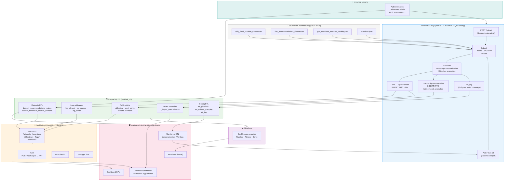

# Diagramme de flux de données

Flux complet des données au sein de la plateforme HealthAI Coach.

---

## Vue d'ensemble



---

## Flux détaillé par étape

### 1. Ingestion (ETL)

| Fichier source | Table cible | Lignes importées |
|---------------|-------------|-----------------|
| `daily_food_nutrition_dataset.csv` | `aliment` | ~1 294 |
| `diet_recommendations_dataset.csv` | `dataset_recommendations_regime` | 1 000 |
| `gym_members_exercise_tracking.csv` | `dataset_historique_seance_exercice` | 7 194 |
| `exercises.json` | `exercice` | 873 |

### 2. Transformation & qualité

- **Nettoyage** : suppression doublons, normalisation casse, conversion types
- **Validation** : vérification plages (âge 0-150, poids 0-999kg, BPM 0-300...)
- **Routage** : ligne valide → table production | ligne anomalie → `*_import_anomalies`
- **Traçabilité** : chaque run crée une entrée `etl_log` (nb lignes, statut, durée)

### 3. Exposition API

- Toutes les routes protégées par `x-api-key` + `x-client-id`
- Routes utilisateur protégées par JWT (`Authorization: Bearer`)
- Swagger interactif sur `/doc`

### 4. Validation des anomalies (Admin)

```
Admin liste les anomalies (GET /datasets/*?status=anomalie)
    ↓
Correction manuelle (PATCH /datasets/:id)
    ↓
Validation (POST /datasets/:id/validate) → status = 'validated'
  ou Rejet  (POST /datasets/:id/reject)  → status = 'rejected'
```

### 5. Analytics (Metabase)

Metabase se connecte **directement à PostgreSQL** en lecture seule.  
Les dashboards affichent les données en temps réel sans passer par l'API.
